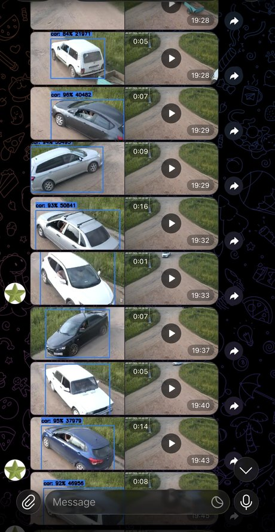

# frigate-notify-alert

**🇬🇧 English:** [README.md](README.md) · 🇷🇺 Русская версия (эта страница).

Уведомления **Frigate → Telegram**: при обнаружении человека/машины бот присылает
фото + видео события в чат. Несколько групп камер (каждая в свой чат), фильтр по
зонам и кнопки паузы уведомлений прямо в Telegram.

<p align="center">
  
  <br><sub>Так это выглядит в чате: на каждое событие — фото с рамкой детекции и видеоклип.</sub>
</p>

## Содержание
- [Возможности](#возможности)
- [Требования](#требования)
- [Настройка Frigate (обязательно)](#настройка-frigate-обязательно)
- [Установка](#установка)
- [Конфигурация (`config.py`) — подробно](#конфигурация-configpy--подробно)
- [Обновление](#обновление-до-последней-версии)
- [Несколько групп / масштабирование](#несколько-групп--масштабирование)
- [Пауза уведомлений](#пауза-уведомлений)
- [Управление](#управление)
- [Как это работает](#как-это-работает)
- [Диагностика](#диагностика)
- [Версии](#версии) · [Лицензия](#лицензия)

## Возможности
- 📸 Фото + видео события в Telegram (медиа-группой, беззвучно).
- 📹 Несколько групп камер — каждая в свой чат.
- 🧭 Фильтр по зонам Frigate (`zones`) — слать только когда объект в нужной зоне.
- ⏸ Пауза уведомлений кнопками в чате (15 мин / 1 час / 3 часа / до утра) — по группе.
- ➕ Масштабирование на любое число групп через шаблонный systemd-юнит.
- 🌐 Прокси для Telegram (обход блокировок).

## Требования
- Работающий **Frigate** с включённым **MQTT**.
- **Telegram-бот** (создать у [@BotFather](https://t.me/BotFather)) и ID чата.
- **Python 3.9+**, Linux с systemd (для автозапуска).

## Настройка Frigate (обязательно)

Скрипт ничего не «видит» сам — он берёт события и медиа у Frigate. Чтобы уведомления
приходили с **фото и видео**, во Frigate должны быть включены **три** вещи:

| Что | Зачем | Без этого |
|---|---|---|
| **MQTT** | через него скрипт узнаёт о событиях (`frigate/events`) | уведомлений не будет вообще |
| **Snapshots** | даёт фото события (`has_snapshot`) | не будет фото |
| **Record (записи)** | даёт видео-клип события (`has_clip`) | не будет видео |

Плюс объекты в `objects.track` должны пересекаться с `OBJECTS` из `config.py`, а зоны
(если хочешь фильтр `zones`) — заданы у камер.

### Минимальный пример `config.yml` Frigate (версия 0.14+)
```yaml
mqtt:
  enabled: true
  host: 192.168.1.50          # тот же адрес/логин/пароль пойдёт в MQTT_* в config.py
  user: frigate
  password: секрет

detectors:
  # твой детектор — coral / cpu / openvino и т.д.
  cpu1:
    type: cpu

objects:
  track:
    - person
    - car                     # должно пересекаться с OBJECTS в config.py

# Фото событий — нужно для фото в уведомлении
snapshots:
  enabled: true
  retain:
    default: 14               # дней хранить снимки

# Записи — нужно для видео-клипа в уведомлении (Frigate 0.14+)
record:
  enabled: true
  alerts:
    retain:
      days: 14
      # mode: active_objects   # опционально: active_objects | motion | all
  detections:
    retain:
      days: 14

cameras:
  dvor:                       # ← это имя пойдёт в "cameras": [...] в config.py
    ffmpeg:
      inputs:
        - path: rtsp://ЛОГИН:ПАРОЛЬ@IP_КАМЕРЫ:554/stream
          roles: [detect, record]
    detect:
      enabled: true
    zones:                    # опционально — для фильтра "zones" в config.py
      zone_dvor:              # ← это имя пойдёт в "zones": [...] в config.py
        coordinates: 0.1,0.9,0.9,0.9,0.9,0.1,0.1,0.1
```

`snapshots`, `record` и `objects.track` можно задавать **глобально** (как выше) **или
отдельно у каждой камеры** — важно не «где написано», а **итоговое (эффективное)**
значение у камеры. Рабочий пример: `snapshots` глобально `false`, но включены у нужных
камер — этого достаточно, фото приходят. То же с `objects.track`: можно глобально
`[person]`, а на отдельной камере расширить до `[person, car]`.

> **Версии Frigate.** Пример — для 0.14+ (проверено на **0.17**), где хранение записей
> задаётся в `record.alerts` / `record.detections` (поле `mode` необязательное). В старой
> 0.13 это было `record.events.retain`.
> Официальная документация: [snapshots](https://docs.frigate.video/configuration/snapshots),
> [record](https://docs.frigate.video/configuration/record),
> [objects](https://docs.frigate.video/configuration/objects),
> [zones](https://docs.frigate.video/configuration/zones).

### Проверка, что всё готово
После правки конфига **перезапусти Frigate**. У завершённого события должны быть
`has_snapshot: true` и `has_clip: true` — это видно в UI Frigate (Explore) или через API:
```bash
curl http://IP_FRIGATE:5000/api/events | python3 -m json.tool | grep -E "has_snapshot|has_clip"
```
Если `has_clip` всегда `false` — не включён/не хранится `record`; если `has_snapshot`
`false` — не включён `snapshots`.

## Установка
```bash
git clone https://github.com/Sysoev86/frigate-notify-alert.git
cd frigate-notify-alert

cp config.example.py config.py     # свой конфиг (в .gitignore, в репо не попадёт)
nano config.py                     # заполнить (см. подробный разбор ниже)

./install_deps.sh                  # venv + зависимости
sudo ./manage.sh install           # поставить юниты (по группам из config.py) + пульт
sudo ./manage.sh start
./manage.sh status
```
Ручной запуск без systemd: `./run_monitor.sh`. Проверить версию: `./manage.sh version`.

---

## Конфигурация (`config.py`) — подробно

`config.py` — единственный файл, который нужно править. Сами скрипты трогать не надо.
Всё, что в примере написано КАПСОМ (`"ВСТАВЬ_..."`), — заглушки, их надо заменить.
Кавычки вокруг строк обязательны (это Python); числа (порт) — без кавычек.

### Полный пример
```python
# 1. TELEGRAM ---------------------------------------------------------------
TELEGRAM_BOT_TOKEN = "1234567890:AAxxxxxxxxxxxxxxxxxxxxxxxxxxxxxxx"
TELEGRAM_PROXY_URL = None            # или "http://ЛОГИН:ПАРОЛЬ@IP:ПОРТ"

# 2. ГРУППЫ КАМЕР -----------------------------------------------------------
GROUPS = {
    "group1": {
        "telegram_chat_id": "-1001234567890",
        "cameras": ["dvor", "vorota"],
        "zones": ["zone_dvor"],       # необязательно
        "mute_controls": True,        # необязательно
        "name": "Двор",
    },
    "group2": {
        "telegram_chat_id": "-1009876543210",
        "cameras": ["vhod"],
        "name": "Вход",
    },
}

# 3. MQTT (из настроек Frigate) --------------------------------------------
MQTT_BROKER_HOST = "192.168.1.50"
MQTT_BROKER_PORT = 1883
MQTT_USERNAME = "frigate"
MQTT_PASSWORD = "секрет"
MQTT_TOPIC_PREFIX = "frigate"

# 4. FRIGATE ----------------------------------------------------------------
FRIGATE_URL = "http://192.168.1.50:5000"

# 5. ОБЪЕКТЫ ----------------------------------------------------------------
OBJECTS = ["person", "car", "truck", "bus", "motorcycle", "bicycle"]

# 6. ПРОЧЕЕ (обычно менять не нужно) ---------------------------------------
LOG_LEVEL = "INFO"
LOG_FORMAT = "%(asctime)s - %(levelname)s - %(message)s"
STATS_INTERVAL = 60
MEDIA_WAIT_TIME = 25
MEDIA_RETRY_ATTEMPTS = 15
```

### Разбор по полям

#### Telegram
| Параметр | Обязательно | Описание |
|---|:---:|---|
| `TELEGRAM_BOT_TOKEN` | да | Токен бота от [@BotFather](https://t.me/BotFather): `/newbot` → имя → username → строка вида `1234567890:AA...`. Вставить целиком. |
| `TELEGRAM_PROXY_URL` | нет | `None` = без прокси (обычный случай). Нужен, только если Telegram заблокирован у провайдера. Формат `"http://ЛОГИН:ПАРОЛЬ@IP:ПОРТ"`. |

#### `GROUPS` — группы камер
Группа = набор камер + один чат, куда идут уведомления по этим камерам. Групп может
быть сколько угодно (`group1`, `group2`, `group3`…). Ключ группы (`group1`) — это ещё
и имя systemd-сервиса: `frigate-telegram@group1`.

| Ключ группы | Обязательно | Описание |
|---|:---:|---|
| `telegram_chat_id` | да | Куда слать. Для групп/каналов начинается с `-100…`. См. «как узнать» ниже. |
| `cameras` | да | Список имён камер **ровно как в Frigate** (регистр важен). |
| `zones` | нет | Список зон Frigate. Задан → шлём только если объект зашёл в одну из зон. Нет ключа / пустой список → шлём по всей камере. |
| `mute_controls` | нет | `True` (по умолчанию, даже если ключ не писать) → в чате есть кнопки паузы. `False` → без кнопок для этой группы. |
| `name` | нет | Произвольное название, попадает только в логи. |

**Как узнать `telegram_chat_id`:**
- Личка: напиши боту [@userinfobot](https://t.me/userinfobot) — покажет твой numeric id.
- Группа/канал: добавь **своего** бота в чат, затем напиши там [@getidsbot](https://t.me/getidsbot). ID группы обычно `-100…`.
- ⚠️ Бот должен быть **участником** чата, иначе не сможет туда писать.

**Как узнать имена камер (`cameras`):** это ключи из `config.yml` Frigate, раздел `cameras:`.
```yaml
cameras:
  dvor:        # <- вписывай "dvor"
  vhod:        # <- вписывай "vhod"
```

**Как узнать зоны (`zones`):** ключи из `cameras.<камера>.zones` в `config.yml` Frigate.
```yaml
cameras:
  dvor:
    zones:
      zone_dvor:   # <- вписывай "zone_dvor"
```
Если у камеры зон нет — просто не указывай `zones`, будут ловиться любые объекты на камере.

#### MQTT (берётся из настроек Frigate, раздел `mqtt:`)
| Параметр | По умолч. | Описание |
|---|---|---|
| `MQTT_BROKER_HOST` | — | IP брокера MQTT (обычно там же, где Frigate). |
| `MQTT_BROKER_PORT` | `1883` | Стандартный порт MQTT. |
| `MQTT_USERNAME` / `MQTT_PASSWORD` | — | Логин/пароль из `mqtt:` в конфиге Frigate. |
| `MQTT_TOPIC_PREFIX` | `"frigate"` | Префикс топиков Frigate. |

#### Frigate
| Параметр | Описание |
|---|---|
| `FRIGATE_URL` | Адрес веб-интерфейса Frigate, откуда качаются фото/видео. Обычно `http://IP:5000`. |

#### Объекты и прочее
| Параметр | По умолч. | Описание |
|---|---|---|
| `OBJECTS` | person, car, truck, bus, motorcycle, bicycle | На какие объекты реагировать (имена Frigate). Оставь `["person"]`, если нужны только люди. |
| `LOG_LEVEL` | `"INFO"` | `INFO` или `DEBUG`. |
| `STATS_INTERVAL` | `60` | Раз в сколько секунд писать статистику в лог. |
| `MEDIA_WAIT_TIME` | `25` | Сколько секунд ждать готовности медиа. |
| `MEDIA_RETRY_ATTEMPTS` | `15` | Сколько раз пытаться скачать фото/видео. |

---

## Обновление до последней версии
```bash
sudo ./manage.sh update    # git pull + переустановка юнитов + рестарт
./manage.sh version        # локальная версия и последний тег в origin
```
`config.py` не трогается (он в `.gitignore`), поэтому обновление не ломает настройки.

## Несколько групп / масштабирование
Каждая группа запускается шаблонным юнитом `frigate-telegram@<группа>`, а `manage.sh`
берёт список групп прямо из `config.py`. Чтобы добавить группу (хоть 3-ю, хоть 10-ю):
1. впиши её в `GROUPS` в `config.py`;
2. `sudo ./manage.sh install && sudo ./manage.sh start`.
Ни новых файлов, ни правок кода. Пульт паузы новую группу подхватит сам.

## Пауза уведомлений
Сервис `frigate-telegram-control` (`mute_controller.py`) держит в каждом чате
клавиатуру внизу: `⏸ 15 мин | 1 час | 3 часа | До утра | ▶️ Включить`. Нажал —
уведомления этой группы молчат до конца паузы (переживает перезапуск). Пауза действует
только на ту группу, в чьём чате нажата кнопка.

- Включается флагом `mute_controls` на группу (по умолчанию включено).
- Чтобы бот мог закреплять статус и убирать нажатия — сделай его **администратором**
  чата (не обязательно; без прав просто чуть больше сообщений в чате).

## Управление
Все команды запускаются из папки проекта: `./manage.sh <команда>`. Команды, что
меняют systemd (`install`/`start`/`stop`/`restart`/`enable`/`disable`/`update`/`migrate`),
требуют `sudo`.

| Команда | Что делает | Когда нужна |
|---|---|---|
| `install` | Копирует systemd-юниты (по группам из `config.py`) + пульт и включает автозапуск. Сам **не** запускает — дальше `start`. | Первый раз и после добавления новой группы. |
| `start` | Запускает все сервисы (все группы + пульт паузы). | После `install`; чтобы поднять после `stop`. |
| `stop` | Останавливает все сервисы. | Приостановить работу целиком. |
| `restart` | Перезапускает все сервисы. | После правки `config.py`, чтобы применить. |
| `status` | Показывает статус каждой группы и пульта (работает/упал). | Проверить, всё ли живо. |
| `logs` | Живые логи всех групп + пульта (выход — `Ctrl+C`). | Смотреть, что происходит / искать ошибки. |
| `enable` | Включает автозапуск при загрузке сервера (не запускает сейчас). | Обычно уже сделано `install`; отдельно почти не нужна. |
| `disable` | Выключает автозапуск при загрузке (текущий запуск не трогает). | Временно убрать из автозагрузки, не удаляя. |
| `update` | Обновление до последней версии: `git pull` → переустановка юнитов → рестарт. `config.py` не трогается. | Чтобы подтянуть свежую версию из GitHub. |
| `version` | Печатает локальную версию (`VERSION`) и последний тег в GitHub. | Узнать свою версию / есть ли новее. |
| `migrate` | Разовый переход со старой схемы (отдельные юниты `frigate-telegram-group1/2`) на шаблонные `frigate-telegram@`. | Только при апгрейде со старой установки. |

Типовой первый запуск: `sudo ./manage.sh install && sudo ./manage.sh start`.
Обновиться позже: `sudo ./manage.sh update`.

## Как это работает
Скрипт подписан на MQTT-топик `frigate/events`, ловит завершённые события по нужным
камерам, объектам и (опционально) зонам, дожидается готовности snapshot + clip и
отправляет их в чат медиа-группой. Есть повторные попытки, если медиа ещё не готово.
Пульт паузы (`mute_controller`) — отдельный процесс: слушает нажатия кнопок и пишет
файл `mute_state.json`, который читают мониторы перед отправкой.

## Диагностика
- Сервисы не стартуют → `./manage.sh status`, `journalctl -u 'frigate-telegram@*' -e`.
- Нет уведомлений → проверь, что события есть во Frigate; логи: `./manage.sh logs`.
- `❌ Не найден config.py` → сделай `cp config.example.py config.py`.
- Telegram не доступен (таймауты/`Flood control`) → проверь сеть/прокси; при блокировке
  укажи `TELEGRAM_PROXY_URL`.
- **Одна камера шлёт только фото, видео нет** (у события `has_snapshot: true`,
  `has_clip: false`) → у этой камеры Frigate не удерживает клипы. Частая причина —
  `record.<alerts|detections>.retain.mode: motion` **вместе с маской движения** над зоной,
  где ездят/ходят объекты: детекция срабатывает (снимок приходит), но «движения» там
  Frigate не видит → сегменты записи не хранятся → у события нет клипа. **Фикс:**
  `mode: active_objects` (хранит сегменты с трекнутым объектом, маски движения не мешают).
  После этого `has_clip` становится `true` и видео идёт. `record` обычно глобальный,
  так что это касается всех камер с масками.

## Версии
[Semantic Versioning](https://semver.org/lang/ru/). Изменения — в [CHANGELOG.md](CHANGELOG.md),
релизы — на вкладке [Releases](https://github.com/Sysoev86/frigate-notify-alert/releases).

## Лицензия
[MIT](LICENSE).
